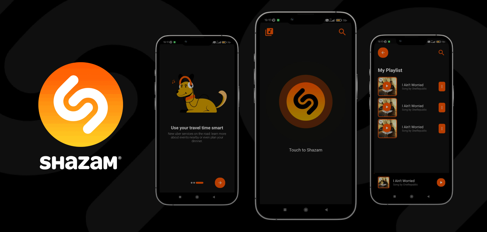

## Shazam Mobile

## Table of Contents

- [Introduction](#introduction)
- [Features](#features)
- [Build Process](#build-process)
- [Tech Stack](#tech-stack)

 

## Introduction
Shazam is an application that can identify music, movies, advertising, and television shows, based on a short sample played and using the microphone on the device.

This is a shazam mobile app which was build using flutter and the music was identified using an ACR Cloud SDK.

## Features

🚀 Identify Music  
🚀 Play/Pause Music

## Build Process

- Clone or download the repo
- `pub get` to install dependencies
- `flutter run` to run the application

## Tech Stack

    
    

## Project Goals & Outcomes

✔️ Mastering Flutter